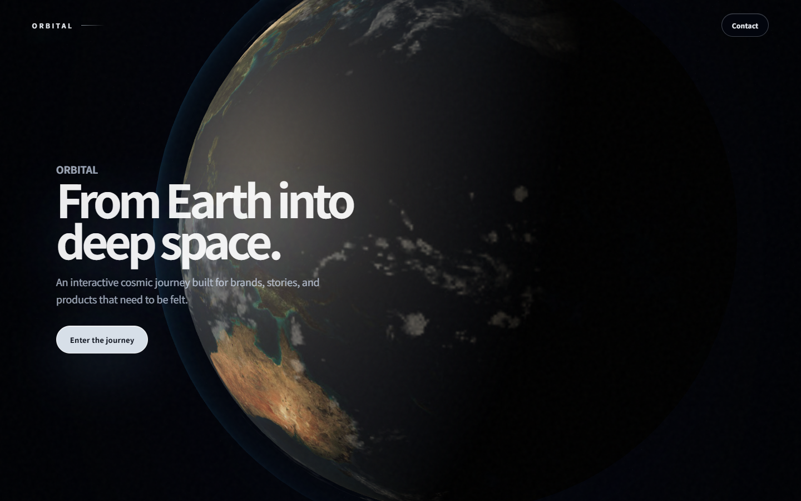

<div align="center">

# ✨ sentence-to-site · Agent Skill Library

**一句話輸入，一個經瀏覽器驗證的網站輸出。**

想法展開（不逼問使用者） · 反通用視覺方向 · 動畫編排 · 真實瀏覽器證據 · 對抗式品質循環

[](https://github.com/twk0672005/sentence-to-site/actions/workflows/validate-skills.yml)
[](skills/catalog.json)
[](https://claude.com/claude-code)
[](https://openai.com/codex/)
[](LICENSE)

[English](README.md) | **繁體中文**

</div>

---

## 🖼️ 實際成品

> **下面這個網站就是用這套 workflow 做出來的** —— 一句話需求 → 視覺方向 → 動畫編排 → 截圖驗證交付。**點圖即看 live。**

[](https://twk0672005.github.io/orbital-spatial-intelligence/)

🔗 **https://twk0672005.github.io/orbital-spatial-intelligence/**

---

## 為什麼需要這套 kit？

Agent 早就很會寫網頁 code，出錯的是 code **以外**的一切：

| 失敗模式 | 裸 agent | **配上 sentence-to-site** |
|---|---|---|
| 模糊需求 → 回你一份問卷 | ❌ 逼問 | ✅ 展開成決定 + 明確假設清單 |
| 每條 prompt 都是同款「漸層 + 毛玻璃」頁 | ❌ 通用感 | ✅ 反通用視覺方向，一個看得見的承諾 |
| build 一過就宣稱「完成」 | ❌ 從未 render | ✅ 強制真實瀏覽器截圖 + readback |
| 自己批改自己作業，還叫「品質循環」 | ❌ 自我批改 | ✅ Planner / Builder / Evaluator / Evidence Auditor 四角色分離 |
| 動畫當裝飾亂加，行動端即爛 | ❌ 隨手加 | ✅ 動畫分道編排 + reduced-motion 後備 |
| 交付時不記錄假設了什麼 | ❌ 靜默 | ✅ 每個推斷決定都列出，一句話可否決 |

貫穿全套的核心規則：**完成與否由瀏覽器裁決，永遠不由 build exit code 裁決。**

你有一個模糊的想法 —— *「幫我的咖啡車做個 landing page，要溫暖，不要太商業」*。載入這套 kit 的 AI agent 會把這句話變成完成的網站：展開成設計前提、替你做好各項小決定（並明確列出）、動手建頁、**在真實瀏覽器裡親眼看它**、修復畫面上最弱的一環，循環到結果誠實可示人為止。

這是一套 **給 AI agent 用的 skill library**（Claude Code、Codex，以及任何讀 `SKILL.md` 的 agent）—— 不是網站生成器 app，不是巨型 prompt，也不是框架。

---

## 架構

```text
                          一句模糊的話
                                │
                                ▼
                ┌───────────────────────────────┐
                │     one-sentence-website      │  旗艦入口
                │    展開 → 決定 → 假設清單      │
                └───────────────┬───────────────┘
                                │ 路由 pipeline
        ┌───────────────┬───────┴───────┬───────────────────┐
        ▼               ▼               ▼                   ▼
┌───────────────┐ ┌─────────────┐ ┌─────────────────┐ ┌────────────────┐
│ visual-story- │ │ website-    │ │ motion-         │ │ browser-       │
│ direction     │ │ motion-     │ │ choreography    │ │ evidence       │
│ 設計前提、     │ │ intake      │ │ CSS/GSAP/WebGL  │ │ 截圖、readback │
│ 反通用層級     │ │ 既有專案盤點 │ │ 分道、reduced   │ │ 誠實裁決       │
│               │ │             │ │ motion          │ │                │
└───────────────┘ └─────────────┘ └─────────────────┘ └───────┬────────┘
                                                              │
                ┌─────────────────────────────────────────────▼───────┐
                │              adversarial-quality-loop               │
                │   Planner → Builder → Evaluator → Evidence Auditor  │
                │        對最弱一環重複循環，直到誠實可示人             │
                └─────────────────────────┬───────────────────────────┘
                                          ▼
                              ┌───────────────────────┐
                              │   delivery-handoff    │
                              │  決定紀錄、證據位置、   │
                              │  已知問題、一句話否決   │
                              └───────────────────────┘
```

### Skill 一覽

| Skill | 用途 |
|---|---|
| [`one-sentence-website`](skills/one-sentence-website/SKILL.md) | **入口。** 一句模糊的話展開成前提 + 明確假設，路由 pipeline，循環 建頁 → 證據 → 修復 |
| [`adversarial-quality-loop`](skills/adversarial-quality-loop/SKILL.md) | 真正的品質循環：Planner / Builder / Evaluator / Evidence Auditor 四角色分離。自我批改永遠不算；降級 solo mode 必須明示 |
| [`cinematic-web-motion`](skills/cinematic-web-motion/SKILL.md) | 薄路由：把網站任務送到最小合適的專門 skill |
| [`visual-story-direction`](skills/visual-story-direction/SKILL.md) | 加特效之前先定：看得見的前提、視覺層級、材質方向與視覺批判 |
| [`website-motion-intake`](skills/website-motion-intake/SKILL.md) | 既有專案的技術棧、權責、既有基線與驗證路線盤點 |
| [`motion-choreography`](skills/motion-choreography/SKILL.md) | 動畫分道（CSS / Motion / GSAP / canvas / WebGL）、scroll 行為、清理、reduced-motion 後備 |
| [`browser-evidence`](skills/browser-evidence/SKILL.md) | 運行中頁面的證明：截圖、瀏覽器 readback、錄影，裁決詞彙 `pass` / `partial` / `blocked` |
| [`delivery-handoff`](skills/delivery-handoff/SKILL.md) | 有邊界的交付：範圍、證據位置、已知問題、隱私安全的接手說明 |

機器可讀的總覽在 [`skills/catalog.json`](skills/catalog.json)。每個 skill 都有自己的 eval fixture；共用指引只在 [`references/`](references/) 保留唯一正本。

---

## 🚀 安裝

把 skills 複製到你的 agent skill 目錄（詳見 [Installation](docs/INSTALLATION.md)）：

```bash
git clone https://github.com/twk0672005/sentence-to-site.git
# Claude Code
cp -r sentence-to-site/skills/* ~/.claude/skills/
# 或讓你的 agent 直接讀 skills/catalog.json
```

然後給你的 agent 一句話：

> *「幫我的咖啡車做個 landing page，要溫暖，不要太商業」*

使用或發佈前先驗證：

```bash
python3 scripts/validate_skill_package.py
python3 tests/validate_skill.py
python3 tests/validate_skill_library.py
python3 tests/validate_release_contract.py
```

可選的可執行瀏覽器證據需要 Playwright；scroll 錄影另需 FFmpeg。詳見 [`references/tooling.md`](references/tooling.md)。

---

## 設計原則

- **一個 skill，一個決策邊界。** 改一行 CSS 不需要載入七個模組；一次載入一個決策範圍的 skill。
- **框架中立。** CSS、Motion、GSAP、canvas、WebGL 都是按需選用的路線，不是必要依賴。靜態 HTML/CSS 往往就是正確答案。
- **證據是能力，不是口號。** 驗證詞彙只留在證據報告裡，永遠不出現在上線頁面的文案中。
- **Clean-room 公開 bundle。** 不含 credentials、客戶素材、私人 prompt 或內部 runtime 設定 —— 由自動化 release-contract 掃描強制執行。

新增模組前先讀 [Architecture](docs/ARCHITECTURE.md)。

---

## 貢獻

先讀 [CONTRIBUTING.md](CONTRIBUTING.md)。新 skill 必須有獨立觸發條件、決策邊界、catalog 條目、對應 eval 與驗證結果；換個名字的重複品不算貢獻。

## 安全

見 [SECURITY.md](SECURITY.md)。請勿公開回報 credentials 或漏洞細節。

## 授權

[MIT](LICENSE)
